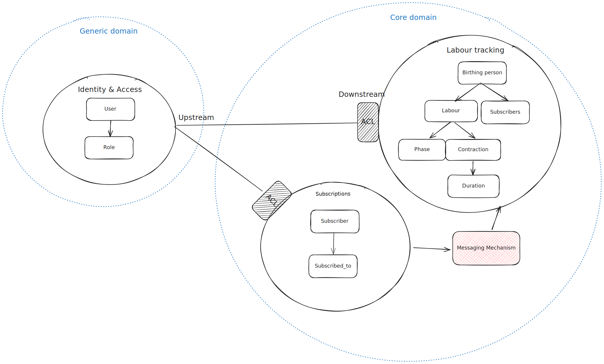
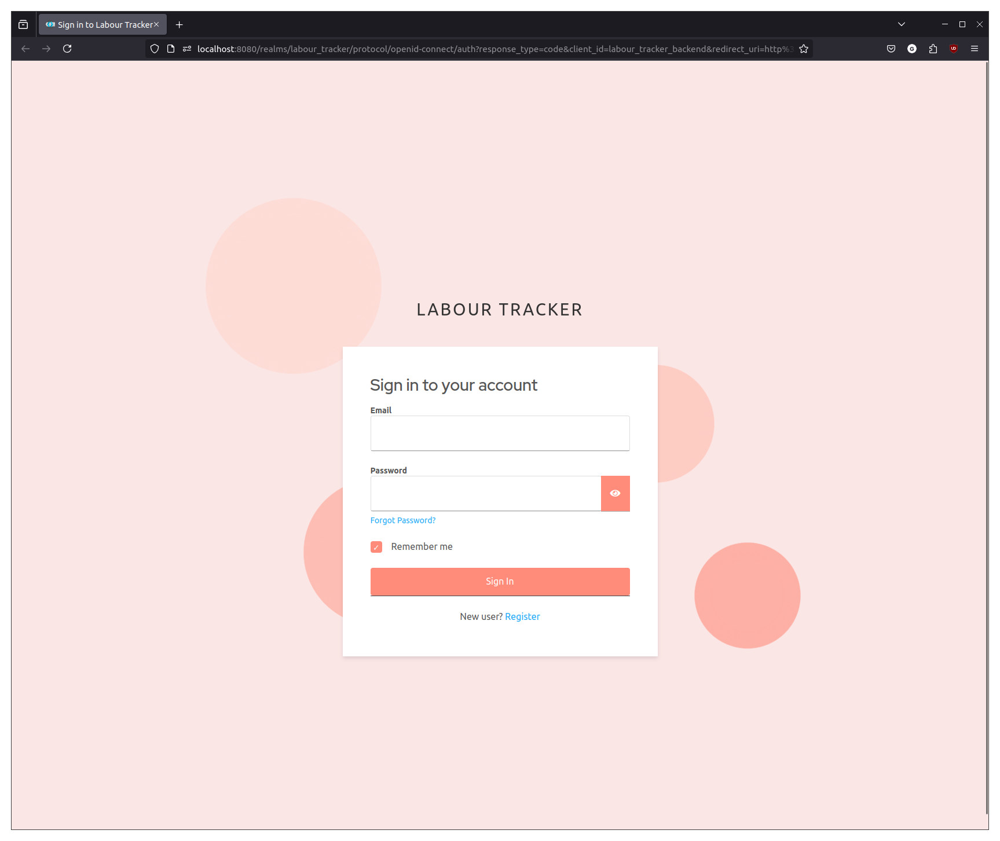

# Labour Tracker

A FastAPI-based backend service for tracking labour-related data, built as a first attempt to use Domain-Driven Design principles and clean architecture.

## Features

- REST API built with FastAPI
- Event-driven architecture using Apache Kafka
- Notification system integrated with:
  - Twilio for SMS
  - SFTP for email delivery
- PostgreSQL database for persistent storage
- Clean/layered architecture with dependency injection using Dishka

## Architecture

The application is structured in the following layers:

- **Domain Layer**: Contains business logic and domain models
- **Application Layer**: Orchestrates use cases and application flow
- **Infrastructure Layer**: Handles external concerns (database, messaging, etc.)
- **Presentation Layer**: API endpoints and request/response handling

## Domain Model

A simplified domain model is as follows:


- **Generic Domain**: Contains the identity and access bounded context. Interactions with other bounded contexts should go through an Anti-Corruption Layer (ACL) which translates the auth providier specific User implementation into the domain User implementation.

- **Core Domain**: Contains the labour tracking and subscriptions bounded contexts. Interactions between these bounded contexts take place through a messaging mechanism.

### Event-Driven System

The application uses Kafka for asynchronous event processing, for two different reasons:
- Decoupling notification handling (sending emails and texts) from the triggers of the notifications (endpoints).
- Triggering side-effects across multiple aggregates.
  - The event types used for this purpose are:
    - `subscriber.subscribed_to`
    - `subscriber.unsubscribed_from`
  - These events are triggered in the `Subscriber` aggregate, and cause additional logic to run on the `BirthingPerson` aggregate.

## Technical Stack

- **Framework**: FastAPI
- **Database**: PostgreSQL
- **Message Broker**: Kafka
- **Dependency Injection**: Dishka
- **Notifications**:
  - Twilio SDK for SMS
  - SFTP for email delivery
- **Development Tools**:
  - Ruff for linting and formatting
  - isort for import sorting
  - mypy for static type checking
 
## Setup

### Prerequisites

Docker and Docker Compose

### Installation

Installation on mac/linux is as follows:

```bash
make build
```

This command builds all of the necessary images.

```bash
make run-deps
```

This command runs the longer running docker compose services:
- db (The postgres database, `app` and `keycloak` databases will be created on startup)
- keycloak (The `labour_tracker` realm will be imported on startup)
- kafka
- zookeeper
- kafka-ui

It is necessary to reset the `labour_tracker_backend` client secret by:
- Logging into the [keycloak admin console](http://localhost:8080).
  - username: admin
  - password: password
- Navigating to:
  - `labour_tracker` realm
  - `labour_tracker_backend` client
  - Credentials
  - Click `Regenerate` for the client secret
  - Copy into the env var: `KEYCLOAK_CLIENT_SECRET`

In a new terminal

```bash
make run-backend
```
To run the rest of the backend services.

The Swagger UI is avaliable at http://localhost:8000


Clicking the `Authorize` button in the top right, then the `Authorize` button in the popup will take
you to the Keycloak login page where you can login and register.




## Acknowledgements

This project's structure was inspired by and built upon the following template repositories:

[fastapi-clean-example by Ivan Borovets](https://github.com/ivan-borovets/fastapi-clean-example)

[full-stack-fastapi-template by FastAPI](https://github.com/fastapi/full-stack-fastapi-template)

Please checkout the first repo, firstly for the brilliant README, but mainly for a better example of using clean architecture and DDD than this repo.
