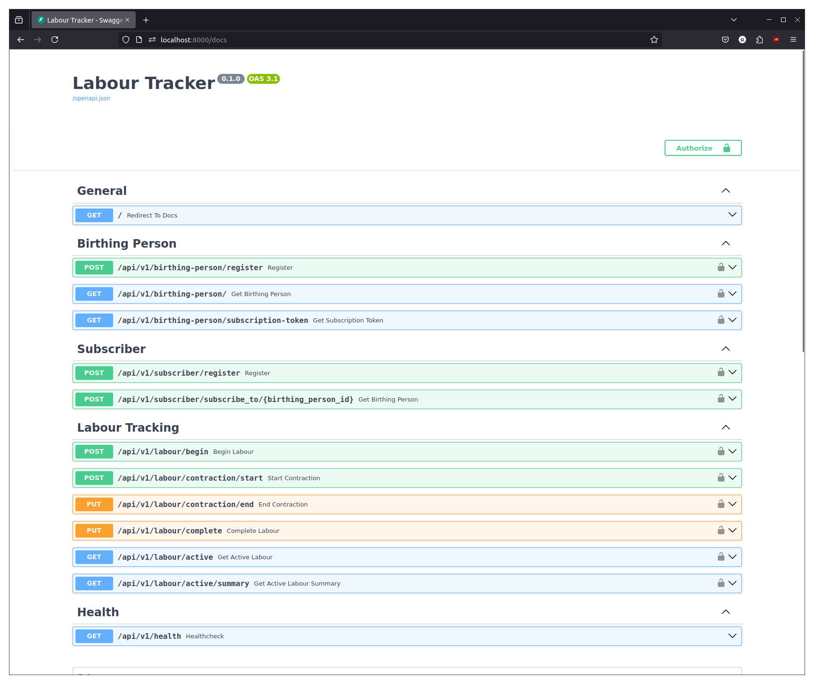

# Labour Tracker
 
## Setup

### Prerequisites

Docker and Docker Compose

### Installation

Installation on mac/linux is as follows:

```bash
make build
```

This command builds all of the necessary images.

```bash
make run
```

This command runs the full stack

The frontend is available at http://localhost:5173
The backend is avaliable at http://localhost:8000



### TODO the rest of the docs